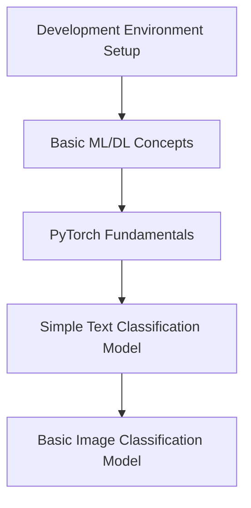
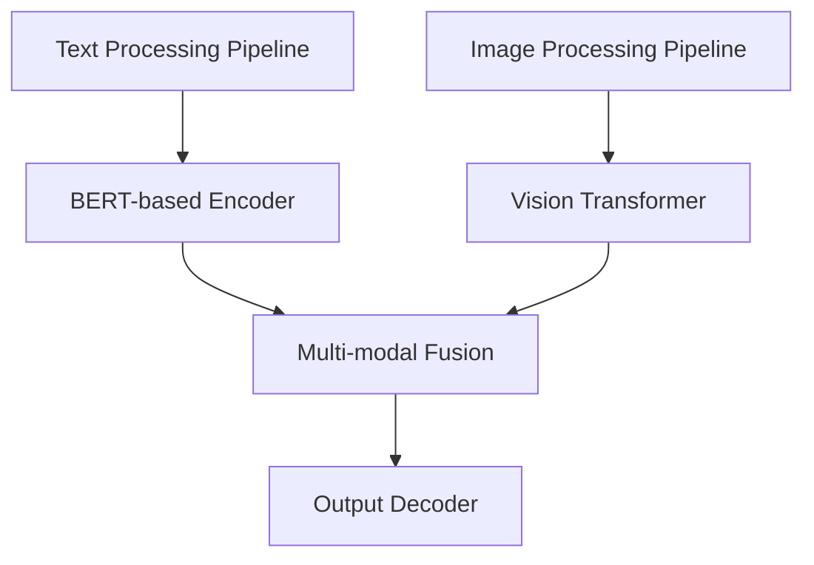
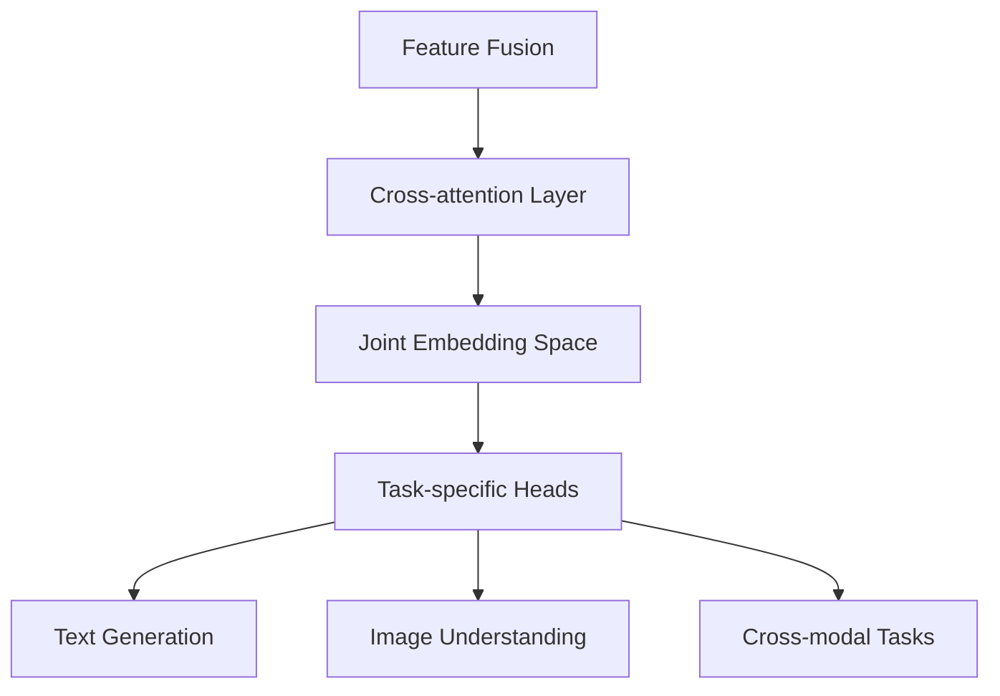
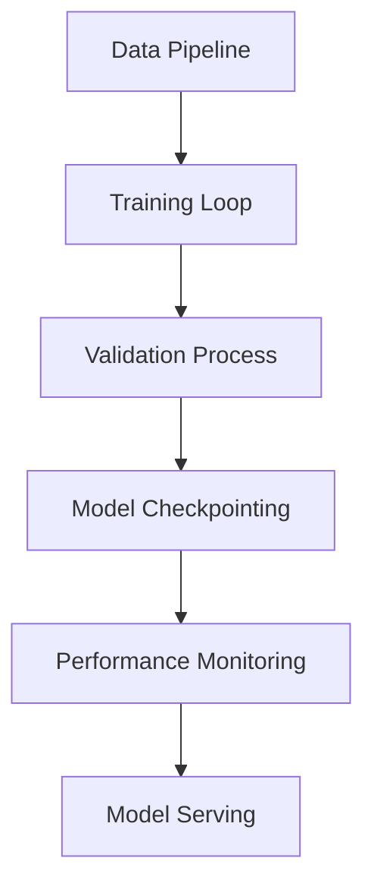

# Multi-modal AI Model Architecture Plan

## Phase 1: Foundation Setup (2-3 months)

- Set up Python environment with key libraries
  - PyTorch
  - Transformers
  - TorchVision
  - NumPy
  - Pandas
- Learn fundamental concepts
  - Neural Networks
  - Loss Functions
  - Optimizers
  - Training/Validation/Testing
- Build basic models to understand the pipeline

## Phase 2: Individual Components (3-4 months)

- Text Processing Component
  - Fine-tune existing transformer models
  - Implement attention mechanisms
  - Text preprocessing pipeline
- Image Processing Component
  - CNN/Vision Transformer implementation
  - Image preprocessing and augmentation
  - Feature extraction

## Phase 3: Multi-modal Integration (2-3 months)

- Implement fusion mechanisms
- Design cross-attention layers
- Create joint embedding space
- Develop task-specific output heads

## Phase 4: Training Infrastructure (2-3 months)

- Build efficient data loading pipelines
- Implement distributed training
- Set up model evaluation metrics
- Create deployment pipeline

## Technical Stack
- **Framework**: PyTorch
- **Libraries**: 
  - Transformers (Hugging Face)
  - TorchVision
  - Lightning (for training)
- **Infrastructure**:
  - Local development with GPU
  - Cloud training (Google Colab/AWS)
- **Deployment**:
  - FastAPI for serving
  - Docker for containerization

## Learning Path and Resources
1. **Foundations**
   - Fast.ai course
   - PyTorch tutorials
   - Stanford CS224N (NLP)
   - Stanford CS231N (Computer Vision)

2. **Advanced Topics**
   - Attention is All You Need paper
   - Vision Transformer paper
   - Multi-modal papers (CLIP, Flamingo)

3. **Practical Implementation**
   - Hugging Face documentation
   - PyTorch Lightning tutorials
   - GitHub repositories of similar projects

## Key Considerations and Challenges
1. **Computational Resources**
   - Start with smaller models
   - Use pre-trained models
   - Leverage cloud GPUs

2. **Data Requirements**
   - Use public datasets initially
   - Implement data augmentation
   - Consider few-shot learning

3. **Model Architecture**
   - Begin with proven architectures
   - Gradually add complexity
   - Focus on modular design

4. **Evaluation Metrics**
   - Define clear success criteria
   - Implement comprehensive testing
   - Monitor training dynamics